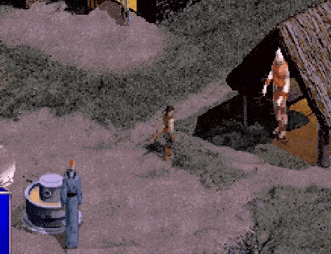

# Introduction
While the PlayStation port of Diablo suffered from obvious downsides such as downscaling graphics by 40% and abysmal loading times, it did have many new features and changes.

All known improvements are showcased here on a golden plaque dedicated to the port.

*Note that the images have reduced quality to keep file sizes down.*

The beta referenced below is the Easy As Pie (12-12-1997) build which can be [downloaded here](https://hiddenpalace.org/Diablo_(Dec_12,_1997_prototype)).

## New Bugs

This section contains bugs specific to the PSX port that are not present in the original game.

#### Lighting
- The torches in the Valor quest will turn white when the game is saved then loaded on level 5. Going to another level and coming back makes them yellow again. It is not known if all torches were intended to be yellow or white.
- Blue and yellow blood stars cast by Succubi use a red light radius when casting. The original game sets the light before the missile type is changed to the blood star variants, which was not accounted for on the PSX so it always uses the default blood star lighting.
- Blue and yellow blood stars cast by Succubi use a red light radius when exploding. This is because the check for missile type uses the base animation and not the exploding animation.

## Bugfixes

This section contains bugs that were fixed that still exist in the original game even in the latest patch.

#### Dungeon Generation
- The player may sometimes warp to Lazarus' lair on level 15 by walking on a seemingly random tile. This tile happens to be the 40x40 coordinate of the Red Portal before it is converted to 112x112. Code: `DRLG_L4PlaceMiniSet`

#### Items
- Spectral Elixir is modified in the item array to be usable after the quest is finished. This was fixed so it reverts back to unusable when a new game is made and also prevented modifying the global data. Code: `InitAllItemsUseable`

## Graphics
The PSX port features 16-bit graphics that allowed for new colors and effects not possible on the PC--which was limited to 256 (8-bit) colors.

#### Braziers

- The graphic for braziers was redrawn to look nicer.
- A glowing/flickering effect was added on top of the flames.
- The flame animation was changed to puffy circles.

## Sound

#### Fading
- The volume of music fades in and out during load times. It also fades out when speeches play.

#### Reverb
- A reverb effect is added to all sound effects when outside of Tristram. This gives the dungeon a more "open" and "dark" feel. The reverb was much more intense in the beta, and toned down a bit for the final game. Concert Hall reverb from the SPU is used.

## Unused
There are several features that were removed from the game. Some are still in the code but disabled, others were active in the beta builds.

#### Nighttime

- When in the dungeon a timer cycles between day and night every 6.25 minutes.
- When the player returns to town it will be night. There are sound effects like crickets chirping and an owl hooting.
- There is also a music loop played when you are close to Ogden's tavern that sounds like men drinking and an instrument playing.
- The night cycle appears to have been scrapped right before release, suggesting they didn't have time to finish. Tavern music was scrapped very early.

#### Flickering Lights

- In the beta there is an effect to make light from torches and braziers "flicker" as it would in reality.
- The code is in the final game but disabled, likely due to concerns over epilepsy.

#### Weird

- There is an unused function called `SetWeirdFX` that makes the screen flash rainbow colors.
- In the final game the flashing effect is only used by Apocalypse to flash white.

#### Frig

- There is a flag to stretch the towners, presumably after beating the game.
- A similar unused bird frig feature exists, where birds flock to the player.
