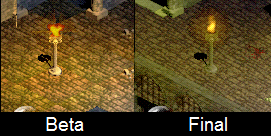
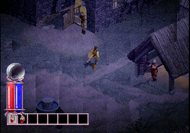
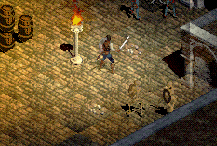
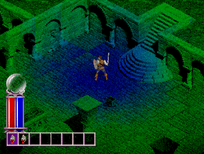

# Introduction
While the PlayStation port of Diablo suffered from obvious downsides such as downscaling graphics by 40% and abysmal loading times, it did have many new features and changes.

All known improvements are showcased here on a golden plaque dedicated to the port.

*Note that the images have reduced quality to keep file sizes down.*

The beta referenced below is the Easy As Pie (12-12-1997) build which can be [downloaded here](https://hiddenpalace.org/Diablo_(Dec_12,_1997_prototype)).

## Bugfixes

#### Dungeon Generation
- The player may sometimes warp to Lazarus' lair on level 15 by walking on a seemingly random tile. This tile actually has the 40x40 coordinate of the Red Portal before it is converted to 112x112. Functions changed: `DRLG_L4PlaceMiniSet`

## Graphics
The PSX port features 16-bit graphics that allowed for new colors and effects not possible on the PC--which was limited to 256 (8-bit) colors.

#### Braziers

- The graphic for braziers was redrawn to look nicer.
- A glowing/flickering effect was added on top of the flames.
- The flame animation was changed to puffy circles.

## Sound

#### Fading
- The volume of music fades in and out during load times. It also fades out when speeches play.

#### Reverb
- A reverb effect is added to all sound effects when outside of Tristram. This gives the dungeon a more "open" and "dark" feel. The reverb was much more intense in the beta, and toned down a bit for the final game. Concert Hall reverb from the SPU is used.

## Unused
There are several features that were removed from the game. Some are still in the code but disabled, others were active in the beta builds.

#### Nighttime

- When in the dungeon a timer cycles between day and night every 6.25 minutes.
- When the player returns to town it will be night. There are sound effects like crickets chirping and an owl hooting.
- There is also a music loop played when you are close to Ogden's tavern that sounds like men drinking and an instrument playing.
- The night cycle appears to have been scrapped right before release, suggesting they didn't have time to finish. Tavern music was scrapped very early.

#### Flickering Lights

- In the beta there is an effect to make light from torches and braziers "flicker" as it would in reality.
- The code is in the final game but disabled, likely due to concerns over epilepsy.

#### Weird

- There is an unused function called `SetWeirdFX` that makes the screen flash rainbow colors.
- In the final game the flashing effect is only used by Apocalypse to flash white.
